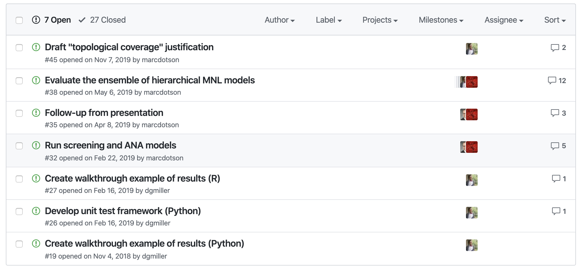
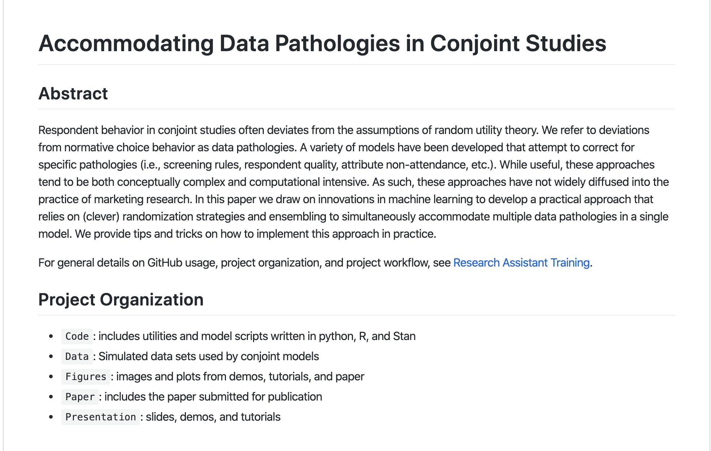
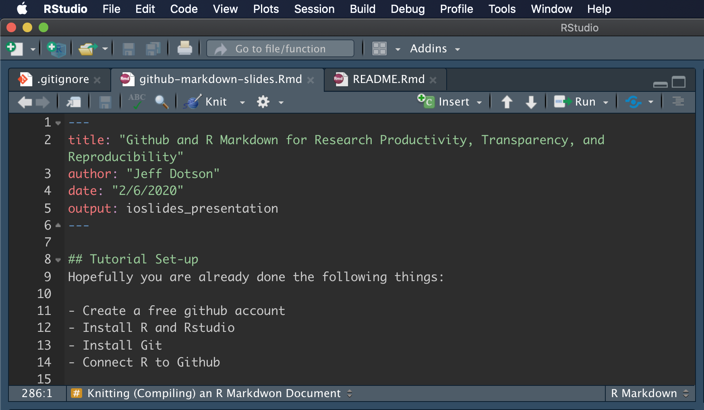

# Introduction

## Tutorial Set-up
Hopefully you are already done the following things:

- Create a free github account
- Install R and Rstudio
- Install Git
- Connect R to Github

If not, work on that now.  It may take a little while to link R and Github.  I can help during our first break. 

Here is a link to the github repo for this tutorial:

https://github.com/jeff-dotson/tilburg-training

## Motivation for Using Github

- Increase productivity, especially when collaborating with co-authors
- Increase transparency and reproducibility
- Increase the visibility of our work (private work offers little value to the rest of society)

## Concerns you might have

- Someone might steal my work!
- What if someone finds and error?!
- I don't want people to see that I'm not a good programmer!

## Workflow
What does your workflow look like?

```{r, out.width = "800px", echo=FALSE}
knitr::include_graphics("Research_Workflow_Blank.png")
```

## Workflow - Crazy
Does it look someting like this?

```{r, out.width = "800px", echo=FALSE}
knitr::include_graphics("Research Workflow Crazy.png")
```

## Workflow - Better
Would it be better if it looked a little like this?

```{r, out.width = "800px", echo=FALSE}
knitr::include_graphics("Research_Workflow_Better.png")
```

# Github and Rstudio

## Introduction to R and RStudio
A quick tour of RStudio

## Getting Started with Github 

GitHub is a powerful collaboration and version control tool. 

We will be using it for:

- **project management**
- **writing**
- **coding**

## Project Management
By project management I primarily mean keeping track of assigned tasks using the **Issues** tab on GitHub. 

We can have an ongoing conversation here about each specific issue and close it out when its completed or resolved. 

Be sure to tag collaborators you want to see the conversation (e.g., `@jeff-dotson`). 

Think of this as an email thread or Slack channel where all of the conversations are in one place, easily searchable, and automatically archived.

## Project Management - Illustration
```{r, out.width = "800px", echo=FALSE}

```

## Writing
Think of using GitHub to collaborate on writing like using something like Google Docs. 

It is essential that we document what we're doing in each project as we do it. This is true for a number of reasons:

1. Writing forces you to think clearly about what you're doing.
2. If you're coding, think of the associated writing as long-form comments.
3. The final product of any project is going to be a paper, so start writing it now.

## Writing
GitHub supports **markdown** syntax, which you're probably more familiar with than you might expect. 

The output is defined in the **YAML**, the header at the top, should always be set to `output: github_document`. 

When you knit changes to your R Markdown document, it will create a markdown document that is easy for GitHub to read.

## Writing Illustration
```{r, out.width = "800px", echo=FALSE}

```

## Coding

GitHub was created for software developers. While we aren't developing software, we will be importing, wrangling, visualizing, and modeling data.

Even if you were just working solo, you will be collaborating with your past self and you should do yourself a favor and impose good version controls on your code.

R Markdown allows us to integrate executable code directly into a document. 

## Coding - Illustration

```{r, out.width = "800px", echo=FALSE}
knitr::include_graphics("coding.png")
```

## Getting Started with Github - Clone a Repo
First **fork** and then **clone** the repo for this tutorial.

https://github.com/jeff-dotson/tilburg-training

This creates a local copy of the repo. 

You do this inside RStudio by creating a new project and selecting `Version Control > Git`.


## Git Basics - Clone a Repo
```{r, out.width = "800px", echo=FALSE}
knitr::include_graphics("clone.png")
```

## Daily Work: Pull, Commit, Push
```{r, out.width = "800px", echo=FALSE}
knitr::include_graphics("daily-work.png")
```

## Daily Work: Pull, Commit, Push

When you start a new work session, you'll want to click on the blue down arrow to **pull** the latest changes from the repo, possibly the work other collaborators have pushed, so you're synced.

## Daily Work: Pull, Commit, Push
Open up the RStudio Project in the clone and work on the project. 

You have a new Git pane in RStudio that notifies you that changes you've made means you are out-of-sync with the **remote** repo (i.e., the one on GitHub). 

Once you've made a number of changes, you click on the files you want to **commit** and click commit. 

Think of a **commit** as saving a snapshot of all of the changes you've made across these files all at once. 

Include a clear commit message. You'll do this fairly frequently for your local repo, possibly just **amending** the same commit each time.

## Daily Work: Pull, Commit, Push
Eventually you'll be ready for other people to have access to your changes on the remote repo. 

To do this, you'll click on the green up arrow to **push** your changes to the remote repo. 

You push far less often than you commit, maybe once a work session, since this means you think it's ready for others to have access to. 

Each time you push, all of your commits are archived on the remote repo, including the **diff** or the side-by-side comparison of what changes you made to the previous version.

## Collaborating: Branches and Pull Requests
Because GitHub is very systematic in the way it manages commits, we will run into commit errors when multiple people have changed the same thing at the same time. 

We can avoid this problem by using **branches**. 

Each branch is a separate version of the repo that exists in parallel, one where you can make changes or experiment without it affecting the **master** branch. 

In fact, the master branch is protected so that you can't accidentally push changes to it.

## Collaborating: Branches and Pull Requests
To do your work as a collaborator, create a new branch on GitHub with a short, descriptive name specific to the issue you're working on (e.g., `jeff-paper-revision`). 

When you start a work session, make sure you select the branch you want to work on from the dropdown in the Git pane in RStudio. 

You can commit, push, and pull as usual to the branch you're working on. 

When you've completed work on the issue associated with the branch, create a **pull request** on GitHub and tag the repo owner (i.e., `@jeff-dotson`). 

## Project Organization
Each project has a similar organization. 

There are certain limitations on the size and type of files that can be pushed to GitHub. 

There are also certain things that shouldn't be accessible by the public (e.g., data we have a licence to access). 

For these reasons, we have folders and files that are pushed to GitHub and those that are not.

## Example Project Organization (Pushed to Github)
* **/Code** Each script should do something specific, have a descriptive name, and include number prefixes if they are meant to be run in a certain order (e.g., `01_import_data.R`, `02_clean_data.R`).
* **/Data** While all data live here, only data that are small and can be shared publically will be pushed.
* **/Figures** Figures live here, including images (saved as PNG files) and data referenced or used for tables, for use in the `README`, paper, and presentation.
* **/Paper** The manuscript of the paper, without any PDF knits, including a specified Creative Commons license.
* **/Presentation** Slides for presentations, again without any PDF knits.
* **README** The abstract and any project-specific details and deviations from this outline.

## Example Project Organization (Not Pushed to Github)
* **/Output** Output from model runs. These files tend to be too large. They are also something each user can create on their own.
* **/Readings** Loose papers that you want to keep track of reading locally. GitHub is not a paper management system.
* **/Temporary** A catch-all folder for *temporary* files specific to a project that might not have anywhere else to live.

Note that you can create **Output**,  **Readings**, and **Temporary** folders in your local clone without worrying about them being pushed. We can further modify the `.gitignore` file to add other folders and files that aren't pushed to GitHub.


## Let's Practice - Create File Structure for your Repo

1. Navigate to the location local repo and create the following folders:
Code, Data, Figures, Paper, Presentation, Output, Readings, and Temporary
2. Modify the **.gitignore** file to prevent Output, Readings and Temporary from being pushed to github
3. Pull, Commit (be sure to add a descriptive comment), and Push
4. Check github to make sure your file structure has been correctly updated

## Github Troubleshooting
Problems will arise, merge conflicts will happen.  

Use Google to sort out any issues you encounter.  

This may involve the need to invoke commands through the terminal to resolve issues 

# R Markdown

## Introduction to R Markdown
R Markdown provides an authoring framework for data science. You can use a single R Markdown file to both

- save and execute code, and

- generate high quality reports that can be shared with an audience.

R Markdown was designed for easier reproducibility, since both the computing code and narratives are in the same document, and results are automatically generated from the source code. 

R Markdown supports dozens of static and dynamic/interactive output formats.

## What can I do in R Markdown?
- Compile a single document into multiple formats (PDF, HTML, Word)
- Create notebooks to run code chunks interactively
- Make slides for presentations (HTML5, Beamer, PowerPoint)
- Produce dashboards with interactive layouts
- Build web-based applications using Shiny
- Write journal articles
- Author books of multiple chapters
- Generate websites and blogs 

See the [R Markdown: The Definitive Guide](https://bookdown.org/yihui/rmarkdown/) for details

## The Structure of an R Markdown Document
- YAML header
- Text (markdown)
- Code chuncks

## YAML - Defines the output of the R Markdown document when compiled
```yaml
---
title: "Hello R Markdown"
author: "Awesome Me"
date: "2018-02-14"
output: html_document
---
```

## Text and Code in R Markdown
```markdown
This is a paragraph in an R Markdown document.

Below is a code chunk:

`r ''````{r}
fit = lm(dist ~ speed, data = cars)
b   = coef(fit)
plot(cars)
abline(fit)
```

## Knitting (Compiling) an R Markdown Document
```{r, out.width = "800px", echo=FALSE}

```

## R Markdown Cheat Sheets
RStudio has created a large number of cheat sheets, including the one-page R Markdown cheat sheet, which are freely available at https://www.rstudio.com/resources/cheatsheets/. 

There is also a more detailed R Markdown reference guide. Both documents can be used as quick references after you become more familiar with R Markdown.

## R Markdown Syntax
The text in an R Markdown document is written with the Markdown syntax\index{Markdown syntax}. Precisely speaking, it is Pandoc's Markdown. 

There are many flavors of Markdown invented by different people, and Pandoc's flavor is the most comprehensive one to our knowledge.

**To practice R Markdown syntax, start by creating a new R Markdown file in RStudio.**  

## R Markdown Syntax - Inline Formatting
- Inline text will be _italic_ if surrounded by underscores or asterisks, e.g., `_text_` or `*text*`. 

- **Bold** text is produced using a pair of double asterisks (`**text**`). 

- A pair of tildes (`~`) turn text to a subscript (e.g., `H~3~PO~4~` renders H~3~PO~4~). 

- A pair of carets (`^`) produce a superscript (e.g., `Cu^2+^` renders Cu^2+^).

- To mark text as `inline code`, use a pair of backticks, e.g., `` `code` ``. 

**Add some text to your R Markdown document and practice each of these formatting conventions.**

## R Markdown Syntax - Inline Formatting
- Hyperlinks are created using the syntax `[text](link)`, e.g., `[RStudio](https://www.rstudio.com)`. 

- The syntax for images is similar: just add an exclamation mark, e.g., ``. 

- Footnotes are put inside the square brackets after a caret `^[]`, e.g., `^[This is a footnote.]`.

- There are multiple ways to insert citations,\index{citation} and we recommend that you use BibTeX databases, because they work better when the output format is LaTeX/PDF. 

## R Markdown Syntax - Block Formatting

Section headers can be written after a number of pound signs, e.g.,

```markdown
# First-level header

## Second-level header

### Third-level header
```

If you do not want a certain heading to be numbered, you can add `{-}` or `{.unnumbered}` after the heading, e.g.,

```markdown
# Preface {-}
```

**Create a few headers (First-, Second-, Third-level) in your document**

## R Markdown Syntax - Block Formatting

Unordered list items start with `*`, `-`, or `+`, and you can nest one list within another list by indenting the sub-list, e.g.,

```markdown
- one item
- one item
- one item
    - one more item
    - one more item
    - one more item
```

**Add an unordered list to your document**

## R Markdown Syntax - Block Formatting

Ordered list items start with numbers (you can also nest lists within lists), e.g.,

```markdown
1. the first item
2. the second item
3. the third item
    - one unordered item
    - one unordered item
```

**Add an ordered list to your document**

## R Markdown Syntax - Block Formatting
Blockquotes are written after `>`, e.g.,

```markdown
> "I thoroughly disapprove of duels. If a man should challenge me,
  I would take him kindly and forgivingly by the hand and lead him
  to a quiet place and kill him."
>
> --- Mark Twain
```

**Add a block quote to your document**

## R Markdown Syntax - Block Formatting
Plain code blocks can be written after three or more backticks, and you can also indent the blocks by four spaces, e.g.,
````markdown
```
This text is displayed verbatim / preformatted
```
Or indent by four spaces:
    This text is displayed verbatim / preformatted
````

**Add some plain text into your document**

## R Markdown Syntax - Block Formatting
In general, you should leave at least one empty line between adjacent but different elements, e.g., a header and a paragraph. This is to avoid ambiguity to the Markdown renderer. For example, does "`#`" indicate a header below?

```markdown
In R, the character
# indicates a comment.
```

And does "`-`" mean a bullet point below?

```markdown
The result of 5
- 3 is 2.
```

## R Markdown Syntax - Math Expressions
Inline LaTeX equations\index{LaTeX math} can be written in a pair of dollar signs using the LaTeX syntax, e.g., `$f(k) = {n \choose k} p^{k} (1-p)^{n-k}$` (actual output: $f(k)={n \choose k}p^{k}(1-p)^{n-k}$); 

Math expressions of the display style can be written in a pair of double dollar signs, e.g., `$$f(k) = {n \choose k} p^{k} (1-p)^{n-k}$$`, and the output looks like this:

$$f\left(k\right)=\binom{n}{k}p^k\left(1-p\right)^{n-k}$$
**Try adding an inline and display equation into your document.**

## R Markdown Syntax - Math Expressions
You can also use math environments inside `$ $` or `$$ $$`, e.g.,

```latex
$$\begin{array}{ccc}
x_{11} & x_{12} & x_{13}\\
x_{21} & x_{22} & x_{23}
\end{array}$$
```

$$\begin{array}{ccc}
x_{11} & x_{12} & x_{13}\\
x_{21} & x_{22} & x_{23}
\end{array}$$

## R code chunks and inline R code {#r-code}

You can insert an R code chunk\index{code chunk} either using the RStudio toolbar (the `Insert` button) or the keyboard shortcut `Ctrl + Alt + I` (`Cmd + Option + I` on macOS).

There are a lot of things you can do in a code chunk: you can produce text output, tables, or graphics. 

**Add a code chunk into your document**

## R code chunks and inline R code {#r-code}
You have fine control over all these output via chunk options, which can be provided inside the curly braces (between ```` ```{r```` and `}`). 

For example, you can choose hide text output via the chunk option `results = 'hide'`, or set the figure height to 4 inches via `fig.height = 4`. Chunk options are separated by commas, e.g.,

````markdown
`r ''````{r, chunk-label, results='hide', fig.height=4}
````

**Add an R expression to your document**

## R code chunks and inline R code {#r-code}
There are a large number of chunk options\index{chunk options} in **knitr** documented at https://yihui.name/knitr/options. A few include:

- `eval`: Whether to evaluate a code chunk.

- `echo`: Whether to echo the source code in the output document (someone may not prefer reading your smart source code but only results).

- `results`: When set to `'hide'`, text output will be hidden.

- `warning`, `message`, and `error`: Whether to show warnings, messages, and errors in the output document. 

**Try modifying the `echo` and `results` options in your code chunk**

## R code chunks and inline R code {#r-code}
- `fig.width` and `fig.height`: The (graphical device) size of R plots in inches. R plots in code chunks are first recorded via a graphical device in **knitr**, and then written out to files. You can also specify the two options together in a single chunk option `fig.dim`, e.g., `fig.dim = c(6, 4)` means `fig.width = 6` and `fig.height = 4`.

- `out.width` and `out.height`: The output size of R plots in the output document. These options may scale images. You can use percentages, e.g., `out.width = '80%'` means 80% of the page width.

## Figures in R Markdown
By default, figures\index{figures} produced by R code will be placed immediately after the code chunk they were generated from. For example:

````markdown
`r ''````{r}
plot(cars, pch = 18)
```
````

**Add a figure to your document**

## Figures in R Markdown

If you want to include a graphic that is not generated from R code, you may use the `knitr::include_graphics()` function, which gives you more control over the attributes of the image than the Markdown syntax of `` (e.g., you can specify the image width via `out.width`). 

````markdown
`r ''````{r, out.width='25%', fig.align='center', fig.cap='...'}
knitr::include_graphics('images/hex-rmarkdown.png')
```
````

## Other Languages Supported in R Markdown
R Markdown provides support (through the knitr package) for a variety of other programming languages including:

- Python
- SQL
- Julia
- C++ 
- Rcpp
- Stan
- JavaScript and CSS
- C and Fortran

Some would argue that R Studio may be the best IDE to work with these languages

## Presentations in R Markdown
R Markdown also allows you to author presentations in a variety of formats including:

- Beamer (Latex)
- Slidy
- ioslides (this presentation)
- PowerPoint

## ioslides Basics
Slides are broken into sections and slides using the`#` and `##` heading tags

Everything else is just R Markdown!  

This makes it incredibly easy to convert a draft paper into a presentation (or vice versa).

**Create a new ioslides presentation and add content from your R Markdown Document**

# Putting it All Together

## Putting It All Together
Let's practice everything we've learned so far by doing the following:

1. Create a new repo in github
2. Clone the repo to your local computer
3. Create a file structure for your documents (Code, Data, Presentation)
4. Create README rmarkdown documents for each folder.  Be sure to set the YAML output to **github_document**
5. Create an ioslides presentation in the Presentations folder
6. Push your new file structure to the remote Github repo.  Remember: pull->commit->push
7. Spend some time editing and compiling the R Markdown documents

# Thanks!

```

